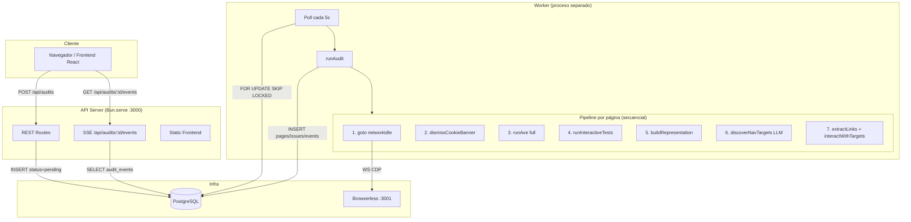
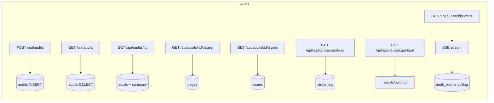
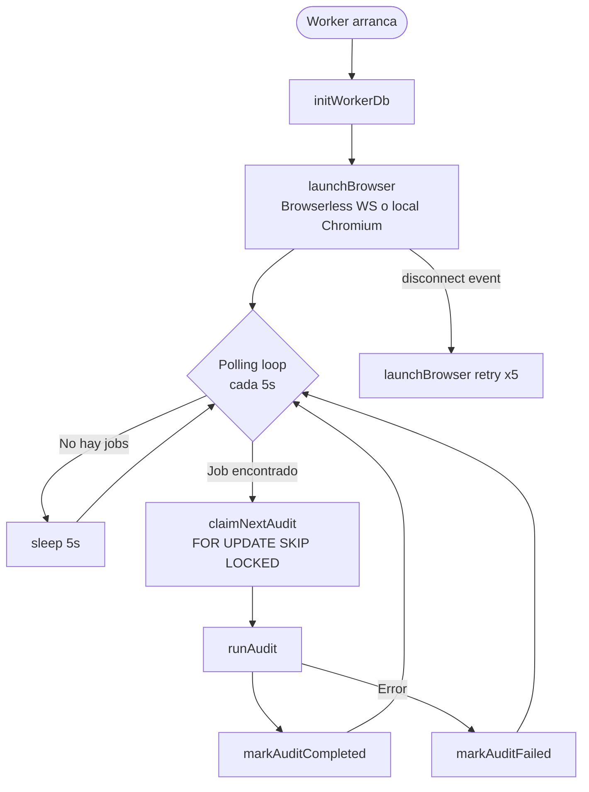
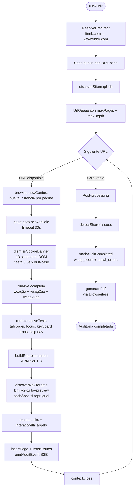
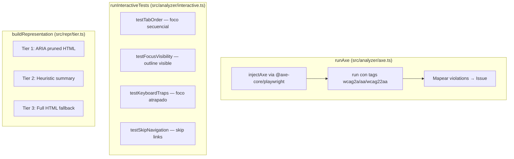
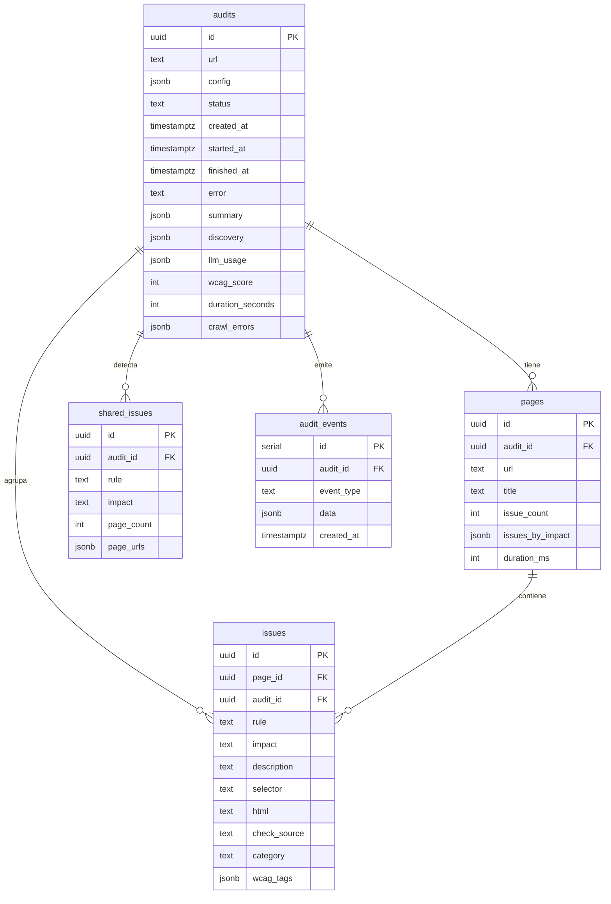
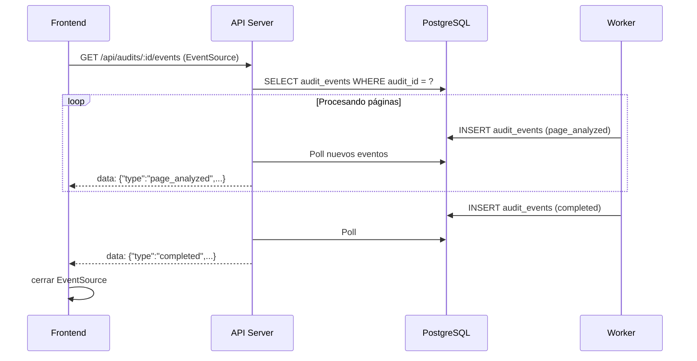
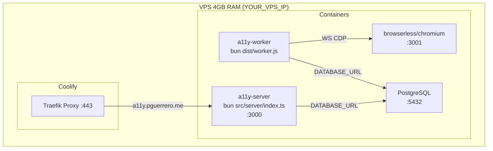

# A11y Crawler — Arquitectura v3 (Actual)

> Estado: en producción. Desplegado en `a11y.pguerrero.me` via Coolify.

## Visión General

Sistema de dos procesos independientes que se comunican a través de PostgreSQL:
- **API Server** — expone REST + SSE, gestiona el frontend, escribe jobs en DB
- **Worker** — procesa auditorías, usa Browserless para Chromium

---

## Componentes

### API Server (`src/server/`)

Sirve el frontend React (build estático en `dist/frontend`) y expone la API REST.

**SSE:** El cliente hace `EventSource` al endpoint `/events`. El servidor hace long-poll sobre `audit_events` y envía cada evento como `data: {...}\n\n`. Conexiones de hasta 255s (Bun `idleTimeout`).

---

### Worker (`src/worker/`)

Proceso independiente. Arranca una sola instancia de Browserless y procesa auditorías en serie.

---

### Pipeline de Auditoría (`src/worker/audit.ts`)

Por cada auditoría, se procesan las páginas **en serie** (una a la vez).

**Problema crítico:** Se crea un `BrowserContext` nuevo por cada página y nunca se recicla → memory leak de ~30MB/página acumulativo (Playwright issue #6319).

---

### Análisis de Accesibilidad

**Problema:** `testFocusVisibility` testa elementos del banner CookieBot → 330 falsos positivos.

---

## Base de Datos

---

## Flujo de Datos: SSE Progress

---

## Despliegue (Docker)

**Restricciones de memoria:**
- Browserless: ~400-600MB por auditoría activa
- Worker: ~200MB + leak de BrowserContext por auditoría
- PostgreSQL: ~200MB
- Disponible para todo: ~1.8GB (4GB - Coolify - otros servicios)

---

## Problemas Identificados en v3

| Problema | Impacto |
|----------|---------|
| `networkidle` wait por página | +3-5s/página en sitios lentos |
| Nuevo BrowserContext por página | Memory leak ~30MB/página, crash en auditorías largas |
| 13 selectores cookie banner | Hasta 6.5s, 330 falsos positivos |
| LLM en cada página | Cost + latencia constante |
| Sin template awareness | Mismo issue reportado 15× en páginas de producto |
| WCAG coverage ~50% | Faltan 8 criterios WCAG 2.2 AA |
| Sin observabilidad | Imposible saber dónde se gasta el tiempo |
| ~10-15s por página | 50 páginas = 500-750s total |
