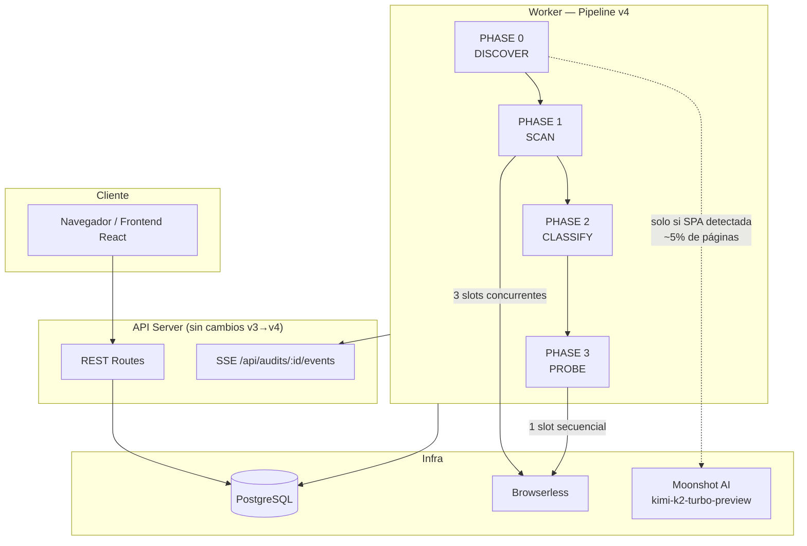
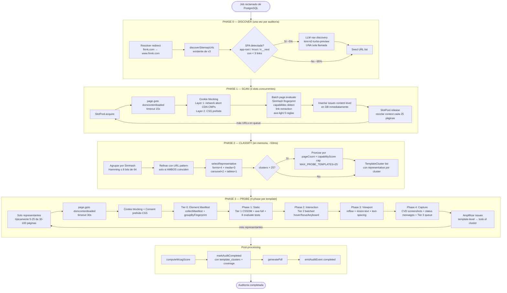
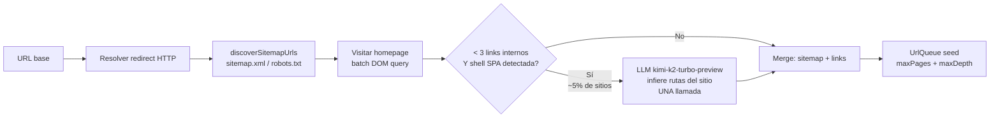
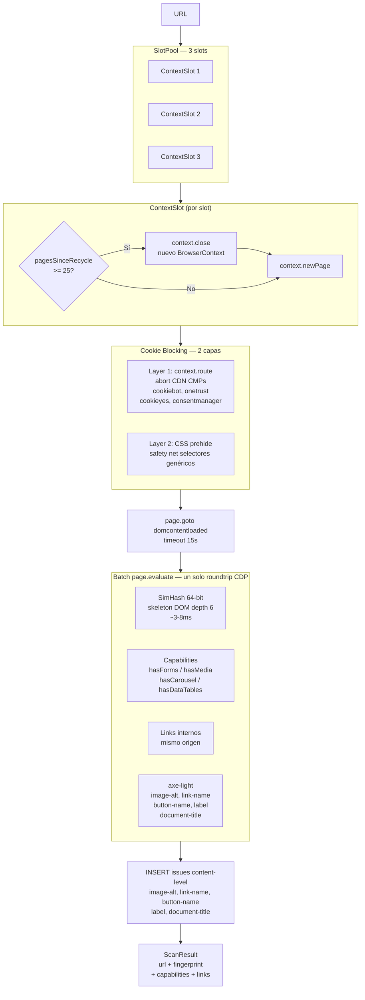
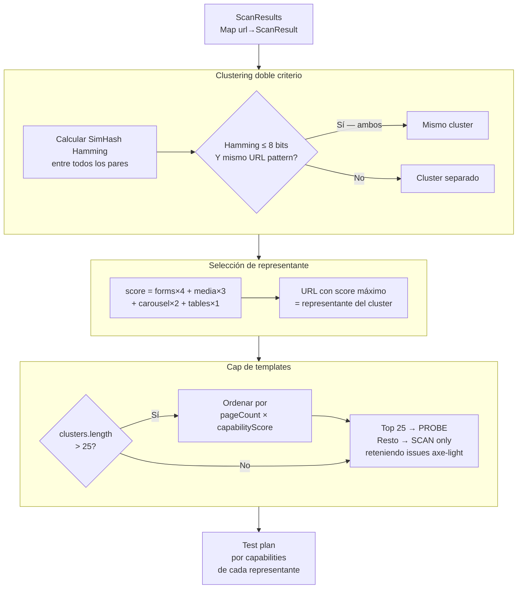
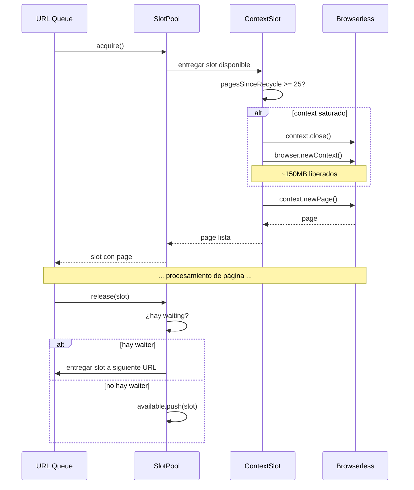
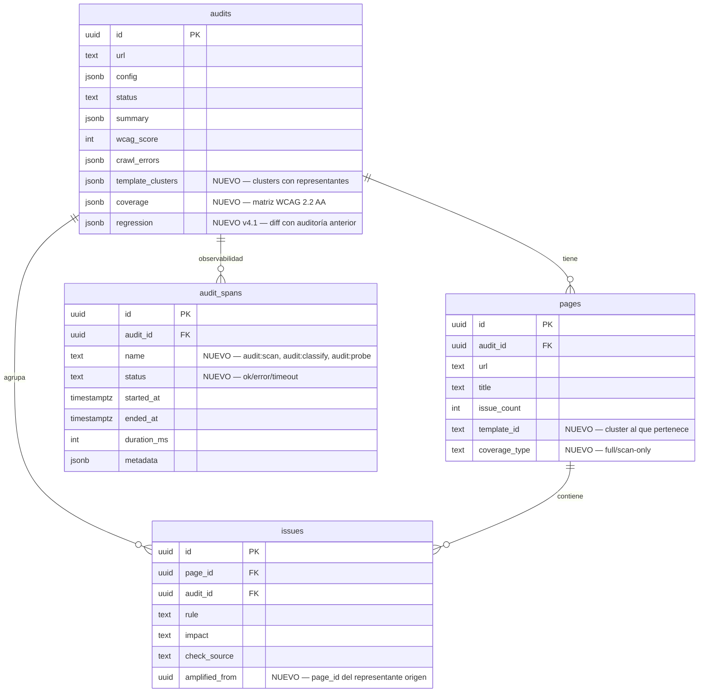
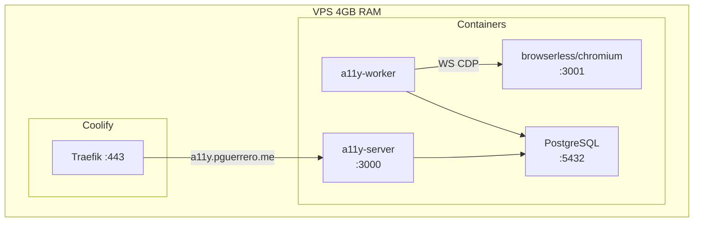
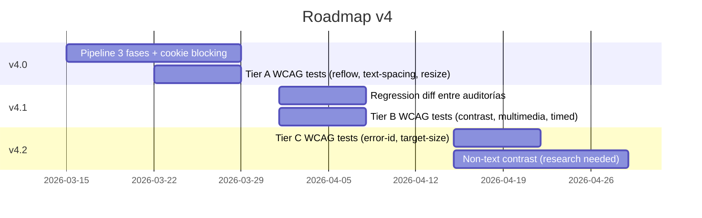

# A11y Crawler — Arquitectura v4 (Propuesta)

> Estado: diseño aprobado. Reemplaza v3.
> Diseño detallado: `docs/plans/2026-03-12-crawler-v4-design.md`

## Visión General

Mismo modelo de despliegue que v3 (API Server + Worker + Browserless), pero con un pipeline de auditoría radicalmente diferente: **3 fases + pre-fase de descubrimiento**, con template clustering para evitar analizar páginas idénticas.



---

## Pipeline Completo



---

## Phase 0 — DISCOVER



---

## Phase 1 — SCAN (Detalle)



---

## Phase 2 — CLASSIFY (Detalle)



---

## Phase 3 — PROBE (Detalle: 4-phase architecture)

> Actualizado: v7.3 (2026-03-23). Legacy single-pass probe eliminado.
> Orquestador: `src/worker/probe.ts` (412 líneas).

```mermaid
flowchart TD
    Representatives["Representantes (máx 25)"] --> Navigate["page.goto domcontentloaded\ntimeout 30s + consent prehide CSS"]
    Navigate --> Tier0["Tier 0: Element Manifest\ncollectManifest + groupByFingerprint"]
    Tier0 --> Phase1

    subgraph Phase1["Phase 1 — Static (no DOM mutation)"]
        P1T1["Tier 1: CSSOM hover/focus contrast\n→ promotes elements to Tier 2"]
        P1AXE["axe-core full (cached)"]
        P1EVAL["Parallel evaluate tests:\ntargetSize, multimedia, timedEvents,\nnonTextContrast, meaningfulSequence,\nsemanticStructure, legalA11y, errorId"]
        P1LLM["sensoryInstructions (LLM text)"]
    end

    Phase1 --> Phase2

    subgraph Phase2["Phase 2 — Interaction (DOM mutation)"]
        P2T2["Tier 2: batched hover/focus/keyboard\n(1 page.evaluate per element)\n→ promotes elements to Tier 3"]
        P2INT["Interactive tests:\nskip-nav, focus-visible, focus-order"]
        P2ANIM["enableAnimations (reset for Phase 3/4)"]
    end

    Phase2 --> Phase3

    subgraph Phase3["Phase 3 — Viewport (viewport mutation)"]
        P3R["testReflow (320px)"]
        P3RS["testResizeText (200% zoom)"]
        P3TS["testTextSpacing (spacing override)"]
    end

    Phase3 --> Phase4

    subgraph Phase4["Phase 4 — Capture (visual evidence)"]
        P4RESET["Viewport reset 1280×720"]
        P4PAR["Promise.all:\ntestColorUse (CVD screenshots + LLM vision)\ntestStatusMessages (MutationObserver)"]
        P4T3["Insert Tier 3 async LLM jobs"]
    end

    Phase4 --> Amplify

    subgraph Amplify["Amplificación de issues"]
        AM1{Tipo de issue}
        AM2[Template-level\nCSS, estructura, contraste\n→ amplificar a TODAS las URLs del cluster]
        AM3[Content-level\nalt, link-name, label\n→ NO amplificar, ya en SCAN]
        AM4[Capability-level\nforms, multimedia\n→ solo reportar en representante]
        AM1 -->|template| AM2
        AM1 -->|content| AM3
        AM1 -->|capability| AM4
    end

    Amplify --> SaveDB[INSERT issues con\ntemplate_id + amplified_from\nsi aplica]
```



---

## Amplificación de Issues

```mermaid
graph LR
    subgraph Cluster["Template cluster: /products/:slug (8 páginas)"]
        Rep["Representante\n/products/widget-pro\n✓ PROBE completo"]
        P2[/products/basic-plan]
        P3[/products/enterprise]
        P4[/products/team]
        P5[/products/...]
    end

    subgraph Issues
        TI["Issue template-level\ncolor-contrast ratio 2.1:1\nen h2.product-title\n(CSS compartido)"]
        CI["Issue content-level\nimage-alt vacío\n(específico de página)"]
    end

    Rep -->|PROBE detecta| TI
    TI -->|amplificado a| P2
    TI -->|amplificado a| P3
    TI -->|amplificado a| P4
    TI -->|amplificado a| P5
    Rep -->|SCAN detectó| CI
    CI -->|NO se amplifica| CI
```

---

## Gestión de Memoria — SlotPool + Context Recycling



**SCAN:** 3 slots concurrentes, recycle cada 25 páginas (~150MB liberados por recycle)
**PROBE:** 1 slot secuencial, recycle cada 5 páginas (páginas más pesadas con full load)

---

## Worker DB — Módulos (v7.3)

> `db.ts` monolítico (450 líneas, 24 exports) dividido en 4 módulos por dominio:

| Módulo | Responsabilidad |
|--------|----------------|
| `db.ts` (67 LOC) | Conexión PostgreSQL, migraciones, `getWorkerDb()` |
| `db-audit.ts` (137 LOC) | Ciclo de vida: claimNextAudit, markAudit*, emitAuditEvent, getIssueCountsByImpact |
| `db-pages.ts` (182 LOC) | Persistencia: insertPageV4, insertIssuesV4, persistSpans, getPreviousAudit, regression |
| `db-tier3.ts` (78 LOC) | Cola LLM async: insertTier3Job, claimNext, complete/fail, cache lookup/set |

---

## Base de Datos — Cambios v3 → v4



---

## Observabilidad — Structured Spans

```mermaid
gantt
    title Audit Spans — ejemplo 50 páginas
    dateFormat  s
    axisFormat %Ss

    section Phase 0
    discover        :0, 5s

    section Phase 1 SCAN
    scan:slot1      :5, 50s
    scan:slot2      :5, 50s
    scan:slot3      :5, 50s

    section Phase 2
    classify        :55, 1s

    section Phase 3 PROBE
    probe:p1        :56, 18s
    probe:p2        :74, 18s
    probe:p3        :92, 18s
    probe:p4        :110, 18s
    probe:p5        :128, 18s

    section Post
    pdf             :146, 10s
```

Cada span se inserta en `audit_spans` con flush al final de cada fase (no solo al terminar la auditoría).

---

## Comparativa v3 → v4

| Aspecto | v3 (actual) | v4 (propuesta) |
|---------|-------------|----------------|
| Pipeline | Secuencial, 1 página a la vez | 3 fases + pre-discover |
| Concurrencia | 1 página | 3 concurrentes en SCAN, 1 en PROBE |
| Wait strategy | `networkidle` (~8s/página) | `domcontentloaded` SCAN, `load` PROBE |
| Cookie handling | 13 selectores DOM, hasta 6.5s | Network abort CDN + CSS prehide |
| WCAG coverage | ~50% (17/29 criterios) | ~75% v4.0 → ~90% v4.2 |
| Template awareness | Ninguna | SimHash + URL pattern clustering |
| Memory leak | ~30MB/página acumulativo | Context recycling cada 25/5 páginas |
| LLM usage | Cada página (nav discovery) | Solo si SPA detectada (~5% páginas) |
| Observabilidad | Ninguna | Spans estructurados por fase |
| Falsos positivos cookies | ~330 | 0 |
| Tiempo 50 páginas | 500-750s | ~200s |
| Máx templates en PROBE | N/A | 25 (cap duro) |

---

## Despliegue (sin cambios respecto a v3)



**Nuevas variables de entorno requeridas:**
- `LLM_API_KEY` — ya existe
- `BROWSERLESS_URL` — ya existe
- Sin nuevas dependencias externas

---

## Fases de Entrega


